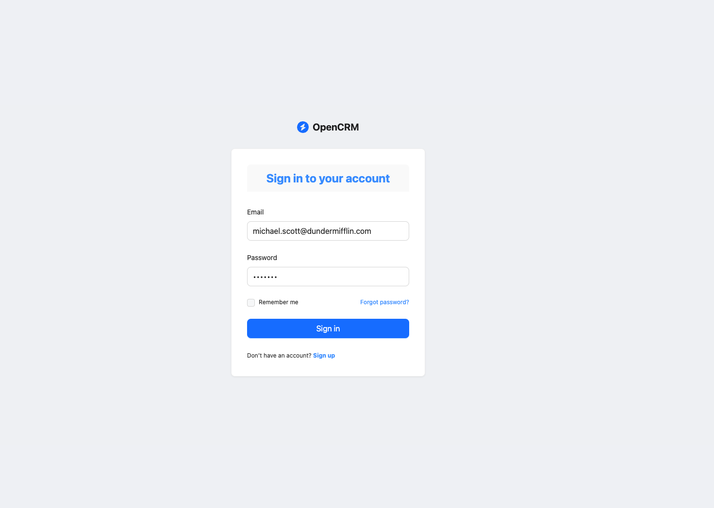
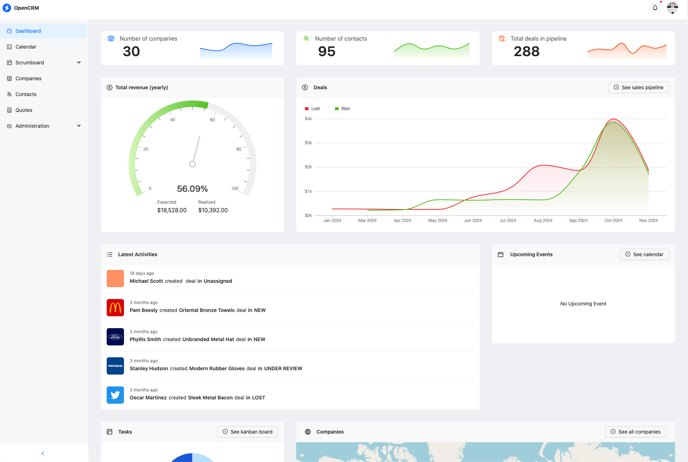
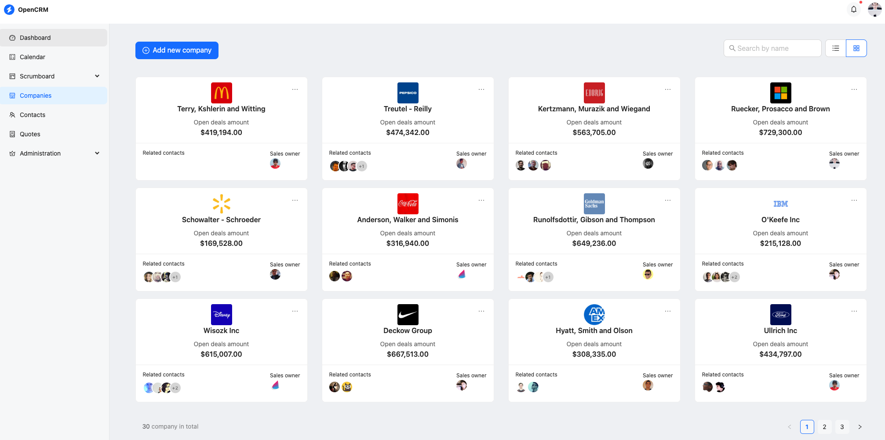
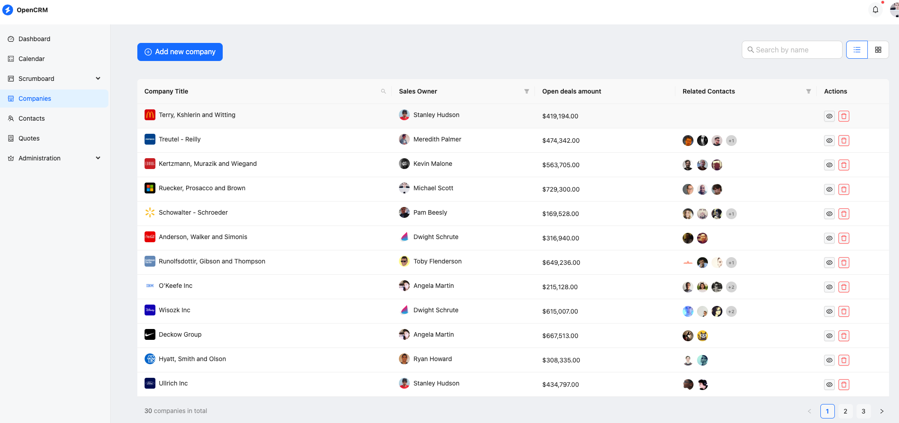

# 🏢 OpenCRM – Spring Boot + GraphQL CRM Example

> 🚨 **Note:** This project is for **learning purposes only**. It is **not recommended** to deploy it directly to a production environment.

---

## 📸 Screenshots

<table>
  <tr>
    <td style="width: 50%;"></td>
    <td style="width: 50%;"></td>
  </tr>
  <tr>
    <td style="width: 50%;"></td>
    <td style="width: 50%;"></td>
  </tr>
</table>

---

## 📖 About

**OpenCRM** is a complete **Customer Relationship Management** (CRM) example project.  
It provides tools and features to manage customer data, track interactions, and streamline business processes.

This project is inspired by [Refine CRM Example](https://github.com/refinedev/refine/tree/main/examples/app-crm), built using **[refine](https://refine.dev/)** and **[Ant Design](https://ant.design/)**.  
The backend implements a **GraphQL API** using **[Spring for GraphQL](https://github.com/spring-projects/spring-graphql)**.

---

## ✨ Features

- 📊 **Dashboard Analytics**
- 📅 **Calendar** for scheduling appointments
- 📋 **Scrum Board** for task management
- 🔄 **CRUD Operations** for companies, contacts, and quotes
- 🔐 **Security**
  - `/graphql` HTTP and WebSocket endpoints secured via **JWT tokens**
  - Method-level access control via `@PreAuthorize`
- 🧪 **Testing**
  - GraphQL endpoint tests (including security)
  - End-to-end browser tests with [Playwright](https://playwright.dev/)
- ⚙️ **GitHub Actions CI/CD**
  - Builds & tests backend
  - Spins up backend + DB via Docker Compose for E2E tests
  - Workflow file: `.github/workflows/build-app.yml`

---

## 🛠 Tech Stack

**Backend**
- Java 21
- Spring Boot 3.4.3
- Spring Data JPA
- Spring Web & WebFlux
- Spring Security + OAuth2 Resource Server
- Spring for GraphQL
- Flyway (PostgreSQL migrations)
- Jacoco (test coverage)

**Frontend**
- [refine](https://refine.dev/) + Ant Design
- GraphQL code generation
- pnpm for package management

**Database**
- PostgreSQL (via Docker Compose)

---

## 🚀 Getting Started

### 1️⃣ Run in GitPod (Cloud IDE)
> _Coming soon..._

---

### 2️⃣ Run Locally

#### **Backend Setup**
```bash
# Navigate to backend folder
cd backend

# Build the project
./gradlew build

# Run the application
./gradlew bootRun

# Server will start at http://localhost:8080
